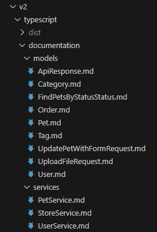

import Tabs from '@theme/Tabs';
import TabItem from '@theme/TabItem';

# Reducing API Integration Time with Improved TypeScript SDK

The liblab-generated TypeScript SDK enhances developer experience by reducing integration time, simplifying maintenance, and incorporating best practices. With the newest version 2, you'll experience significant improvements in validation, documentation, and code clarity. By focusing on minimal dependencies, specifically using Zod, this SDK enhances security and ensures that it remains reliable and easy to maintain. 

## Key Features of liblab's TypeScript SDK

- **Automatic SDK Generation:** With liblab, you can automatically generate a TypeScript SDK for your API. This automation saves you time and effort, allowing you to focus on building your application rather than developing an SDK from scratch.

- **Integrated Documentation:** The SDK comes with integrated documentation, making it easier for developers to understand how to use the API. This reduces the time needed to learn how to integrate the API so your customers can get started quickly. In version 1, the documentation was part of the README file, with all classes and functions. Version 2 improved on that. Now, each service and model has its own documentation, which is better organized and cleaner for the end-user.

- **Simplified Maintenance:** When your API updates, the SDK updates too. This automatic synchronization prevents compatibility issues and makes maintenance much easier and faster. In addition, every time the SDK is generated, the documentation is automatically updated, keeping everything in sync. 

- **Error Reduction:** Because the SDK is automatically generated based on your API's specification, there’s a lower risk of common errors that can occur with manual implementations, including typos and incorrectly handling return calls.

- **Faster Integration:** A well-documented and tested SDK means you can integrate the API functionalities into your projects quickly without worrying about the implementation details.

## What’s New in Version 2?

The transition from TypeScript SDK version 1 to version 2 brings a host of new features and improvements, including the introduction of the Zod tool, better information handling for API requests, better automatic documentation generation, and cleaner example code.

### Introducing the Zod Tool

liblab’s TypeScript SDK V2 introduces Zod, a powerful library for validation and typing. With Zod, you can define schemas to validate data efficiently and securely, ensuring that the data you handle always meets your standards. This reduces errors and optimizes your application’s performance by preventing unnecessary API calls. The following points highlight the Zod adoption benefits:

- **Reduced Attack Surface and Lower Maintenance:** By limiting dependencies to just Zod, the SDK minimizes its attack surface, lowering the risk of security vulnerabilities. Fewer dependencies also make updates and maintenance easier.

- **Enhanced Security and Reliability:** Zod enforces strict input validation and type safety, helping you avoid common security issues like injection attacks.

- **Avoidance of Supply Chain Attacks:** Relying on a single, well-maintained dependency like Zod significantly reduces the risk of supply chain attacks compared to using multiple third-party packages. 

### Enhanced Information with Each API Request

Version 2 provides more detailed information with each API request, including:

- **Detailed Metadata**: V2 introduces a metadata section that provides comprehensive details about the request status, headers, and server information, offering more context for debugging and integration.

- **Organized Response Structure**: The V2 response separates the content into data and metadata, making it easier to access information and enhancing the overall response readability.

- **Raw Data Access**: The V2 response also includes a raw property, allowing direct access to the raw binary data, providing more flexibility for advanced use cases.

The following tabs present examples from the same function response from each TypeScript SDK generated with liblab.

<Tabs>
  <TabItem value="v1" label="Version 1 (Old)" default>
    ```json
      {
        sold: 1,
        string: 415,
        unavailable: 1,
        'Out Of Stock': 43,
        '{{PetStatus}}': 1,
        available: 305,
        invalid: 1,
        Error: 134,
        Available: 45,
        awaiable: 1,
        peric: 26
      }
      ```
  </TabItem>
  <TabItem value="v2" label="Version 2 (New)">
    ```json
      {
        metadata: {
          status: 200,
          statusText: 'OK',
          headers: {
            'access-control-allow-headers': 'Content-Type, api_key, Authorization',
            'access-control-allow-methods': 'GET, POST, DELETE, PUT',
            'access-control-allow-origin': '*',
            connection: 'keep-alive',
            'content-type': 'application/json',
            date: 'Wed, 28 Aug 2024 16:55:04 GMT',
            server: 'Jetty(9.2.9.v20150224)',
            'transfer-encoding': 'chunked'
          }
        },
        raw: ArrayBuffer {
          [Uint8Contents]: <7b 22 73 74 72 69 6e 67 22 3a 34 31 31 2c 22 75 6e 61 76 61 69 6c 61 62 6c 65 22 3a 31 2c 22 4f 75 74 20 4f 66 20 53 74 6f 63 6b 22 3a 34 33 2c 22 7b 7b 50 65 74 53 74 61 74 75 
      73 7d 7d 22 3a 31 2c 22 61 76 61 69 6c 61 62 6c 65 22 3a 33 30 38 2c 22 69 6e 76 61 6c 69 64 22 3a 31 2c 22 45 72 72 6f 72 ... 45 more bytes>,
          byteLength: 145
        },
        data: {
          string: 411,
          unavailable: 1,
          'Out Of Stock': 43,
          '{{PetStatus}}': 1,
          available: 308,
          invalid: 1,
          Error: 134,
          Available: 45,
          awaiable: 1,
          peric: 27
        }
      }
      
      ```
  </TabItem>
</Tabs>

The additional information makes it easier to debug and understand the operation being performed. As a result, developers have greater visibility into data flow and API behavior, enabling quicker identification of potential issues. 

### Automatic Documentation Generation

The new TypeScript SDK version includes a system that automatically generates more detailed documentation for the SDK's functionalities and endpoints. This feature aims to help new users adopt the SDK more quickly and to serve as a continuous resource for developers, ensuring the correct usage of the available features. In version 1, the generated documentation was provided through only one README file. In version 2, the documentation is provided in a folder organized by models and services, making it easier for developers to navigate and access the desired content. The following image displays an example of documentation organition generated with version 2.



### Cleaner Example Codes

In version 2, we’ve focused on providing cleaner and more straightforward example code. The code examples have been redesigned to be more intuitive and easier to understand, regardless of a developer’s experience level. This makes it easier for developers to know how to implement the SDK, speed up the development process, encourage best development practices, and contribute to creating more efficient and well-structured applications. Below, you find a comparison between a code example generated with the old TypeScript SDK and the new version 2.

<Tabs>
  <TabItem value="v1" label="Version 1 (Old)" default>
    ```
    ### **getInventory**
    Returns pet inventories by status
    - HTTP Method: GET
    - Endpoint: /store/inventory
    **Return Type**
    GetInventoryResponse
    **Example Usage Code Snippet**
    ```Typescript
    import { Testsdk } from 'testsdk';
    const sdk = new Testsdk({ accessToken: process.env.TESTSDK_ACCESS_TOKEN });
    (async () => {
      const result = await sdk.store.getInventory();
      console.log(result);
    })();
    ```
  </TabItem>
  <TabItem value="v2" label="Version 2 (New)">
    ```
    ## getInventory
    Returns a map of status codes to quantities
    - HTTP Method: `GET`
    - Endpoint: `/store/inventory`
    **Return Type**
    `any`
    **Example Usage Code Snippet**
    ```typescript
    import { TestSdk } from 'test-sdk';
    (async () => {
      const testSdk = new TestSdk({
        token: 'YOUR_TOKEN',
      });
      const { data } = await testSdk.store.getInventory();
      console.log(data);
    })();
    ```
  </TabItem>
</Tabs>

### Dev Container Enabled

Now, with the V2 version, you have the option to generate dev containers for your SDK. A dev container is a development environment encapsulated within a container using technologies like Docker. This ensures consistency across different development machines. It includes everything required for the development environment. For more information, refer to the [dev container](https://developers.liblab.com/cli/config-file-overview-customizations#devcontainer) page.

## Set Up liblab for TypeScript

Below, you will find a quick tutorial on how to set up liblab to generate a TypeScript SDK using version 2.

### Prerequisites

To use liblab, you'll need:

- The [liblab CLI](https://docs-endpoint-customization.docs-e4f.pages.dev/get-started/getting-started/) installed and logged in
- [An API spec](https://docs-endpoint-customization.docs-e4f.pages.dev/reference/spec-support/)
- [Node.js](https://nodejs.org/en/download/package-manager) installed in your machine with version 20.10.00 or higher

### 1. Create the SDK

To create TS SDKs using liblab, follow the steps below:

1. Log into liblab:

```bash
liblab login
```

This will redirect you to your default browser to confirm the code in the terminal.

2. Then, initialize liblab using your target API, as presented in the following code snippet:

```bash
liblab init --spec <OPEN_API_ADDRESS>
```

> **Note:** The OpenAPI file must be in JSON or YAML format.

3. In the Languages field, set the value to:

```json
["Typescript"]
```

4. Finally, run the command to build the project:

```bash
liblab build
```

### 2. Publish the SDK

To use the TypeScript SDK created in your project, first, you'll need to [create an npm package](https://docs.npmjs.com/creating-node-js-modules) from your SDK.
You can use this [tutorial](https://developers.liblab.com/tutorials/integrate-with-github-actions) to use GitHub Actions with liblab to automate the SDK generation and publishing process and ensure that a new SDK version is generated and made available for your users after each API update.

### 3. Use the SDK

After creating and publishing your TypeScript SDK npm package, your users can install the SDK using the following command:

```bash
npm install your-sdk
```

To import the SDK into the TypeScript project, add the following code to your TypeScript file:

```ts
import { YourSdk } from "your-sdk";
```

After importing, you can call any function from the SDK. The following example presents how to access the function `getInventory()` inside the store service.

```ts
(async () => {
  const yourSdk = new YourSdk({
    token: "YOUR_TOKEN",
  });

  const data = await yourSdk.store.getInventory();

  console.log(data);
})();
```

You can use the auto-generated SDK documentation to give your SDK users a complete overview of all available SDK functions.

## Benefits for End-Users

The enhancements in Liblab's TypeScript SDK V2 make life easier for developers and deliver tangible benefits for end-users. This SDK helps ensure that your applications are reliable and responsive to the user's needs. Because the SDK simplifies and speeds up the integration process, developers can roll out new features more quickly. This keeps your application fresh and aligned with user expectations, enhancing overall user satisfaction.

## Conclusion

With liblab’s TypeScript SDK, integrating your API has never been easier. The improvements in version 2, such as the introduction of Zod, cleaner example code, and a better automatic documentation updates, ensure that your development process is faster, safer, and more efficient. Start using the enhanced SDK today to streamline your API integration and focus on what really matters, building great applications.
